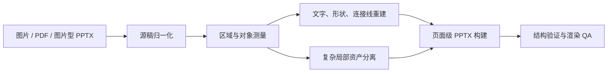

<div align="center">
  <p>
    
  </p>
  <h1>Image2PPT</h1>
  <p>把图片型幻灯片、扫描 PDF、图片型 PPT/PPTX 重建成对象级可编辑 PowerPoint</p>
  <p>
    <a href="https://github.com/Altria600/image2ppt/actions/workflows/ci.yml"></a>
    <a href="#快速开始"></a>
    <a href="LICENSE"></a>
    <a href="README_EN.md"></a>
    
  </p>
</div>

Image2PPT 面向需要保留原稿版式的图片转 PPTX 场景。它把源稿拆成文字、原生形状、连接线和独立图片资产，再用统一的字体、对齐和渲染检查重新组装页面。

它适合处理元素多、层级密、局部关系容易错位的商业 PPT、科研流程图、时间线、卡片式长图和扫描 PDF。输出的重点是**对象级可编辑**：文字可以改，卡片和线条可以移动，复杂插画也可以作为独立图片替换或调整。

## 能编辑到什么程度

| 源稿对象 | PPTX 输出 | 处理原则 |
| --- | --- | --- |
| 标题、正文、编号、标签 | PowerPoint 原生文本框 | 保留文字内容、字号、字体、颜色、位置和对齐关系 |
| 卡片、边框、圆形、分隔线 | PowerPoint 原生形状 | 记录源图像素坐标和圆角尺寸，重复对象使用同一对齐组 |
| 直线、折线、箭头、连接关系 | PowerPoint 原生连接线或形状 | 保留端点、方向、线型和箭头归属 |
| 复杂插画、照片、纹理、无法稳定测量的视觉局部 | 独立图片资产 | 只保留实际局部，不用整页截图覆盖可编辑对象 |
| 低分辨率或缺失字体造成的细节 | 需要人工复核 | 输出会记录渲染差异，不把不确定结果伪装成完全一致 |

复杂视觉保留为独立图片，并不等于整页不可编辑。文字、卡片、连接线和可测量结构仍然会拆开输出。

### 工作流



每一页都使用同一份 `manifest.json` 作为构建来源。`text_style_id`、`alignment_group` 和 `role` 用来约束重复文字、编号框和卡片的字体、字号、行距与对齐锚点，避免出现同一板块里字号漂移或编号框不齐。

## 快速开始

### 在 Codex 中安装

```bash
mkdir -p .agents/skills
git clone https://github.com/Altria600/image2ppt.git .agents/skills/image2ppt
```

然后在对话中使用：

```text
使用 $image2ppt，把 input.pdf 按原页面比例重建成对象级可编辑 PPTX。
文字、卡片、连接线和箭头需要独立可编辑；复杂插画可以保留为独立图片资产；完成渲染 QA 后再交付。
```

### 在 Claude Code 中安装

```bash
mkdir -p .claude/skills
git clone https://github.com/Altria600/image2ppt.git .claude/skills/image2ppt
```

### 本地运行 CLI

```bash
python .agents/skills/image2ppt/cli/image2ppt/cli.py doctor --json
python .agents/skills/image2ppt/cli/image2ppt/cli.py prepare input.pdf --out-root output/image2ppt
```

单页或多页重建应由 Agent 按 `SKILL.md` 的页面生命周期完成：准备输入、逐页重建、构建 PPTX、渲染检查、记录结果、最终装配。

## 配置

`config.yaml` 只用于本地机器，已被 Git 忽略；不要把 Token 或 API Key 写入仓库。需要手动配置时，可从 `config.example.yaml` 复制模板；如果要指定其他配置目录，可设置 `IMAGE2PPT_CONFIG_HOME`。

### 可选的在线 OCR

默认的 `builtin-ink` 只能测量文字区域，不能读取文字内容。需要更好的文字识别时，可以在百度 AI Studio 申请 [PaddleOCR Access Token](https://aistudio.baidu.com/account/accessToken)，再写入本地配置：

```yaml
PADDLE_OCR_TOKEN: "你的 Token"
```

在线 OCR 会把当前任务页面上传到百度服务。敏感材料应使用离线模式，或先确认数据合规范围。

### 可选的图片生成

复杂局部图片优先使用 Agent 内置图像工具。需要兼容第三方 OpenAI Images API 时，可在本地 `config.yaml` 配置：

```yaml
OPENAI_API_KEY: "你的 API Key"
OPENAI_BASE_URL: "https://服务地址/v1"
IMAGE2PPT_IMAGE_BACKEND: "openai-compatible-api"
IMAGE2PPT_IMAGE_MODEL: "供应商提供的模型 ID"
```

图片生成或编辑只接收当前任务所需的提示词和页面图片；敏感内容应选择离线方案或经过批准的服务。

## 输出与验收

一次完整运行会生成：

- 最终 `.pptx`，以及每页的页面级 `.pptx`；
- `manifest.json`，记录文字、形状、图片、坐标、字体和资产来源；
- `validation.json`、区域拆分报告、渲染 PNG 和视觉核对证据。

交付前至少检查：

1. 文字内容没有遗漏，文字仍是独立文本对象；
2. 卡片、边框、连接线和箭头可以单独选择和移动；
3. 复杂图片是有来源记录的局部资产，没有整页截图压住文字；
4. PowerPoint 或 LibreOffice 渲染后，页面比例、字体、位置和层级没有明显漂移。

## 案例

下面展示仓库内的同源案例：第一行是复杂商业 PPT，第二行是科研流程图；每组左侧为源图，右侧为对象级重建结果。重建结果中的选框只用于证明对象可独立编辑，放映时不会出现。

<table>
  <tr>
    <td align="center" width="50%"><strong>商业 PPT · 源图</strong><br></td>
    <td align="center" width="50%"><strong>商业 PPT · 对象级重建</strong><br></td>
  </tr>
  <tr>
    <td align="center" width="50%"><strong>科研流程图 · 源图</strong><br></td>
    <td align="center" width="50%"><strong>科研流程图 · 对象级重建</strong><br></td>
  </tr>
</table>

### 局部清晰度对比

这组放大图用于检查图标轮廓、文字边缘和细线条的保留情况：

<p align="center"></p>

### 复杂关系与细节还原

这组流程图用于检查知识图谱节点、关系线、箭头方向和局部排版：

<p align="center"></p>

### 项目结构

```text
SKILL.md                         # Agent 使用说明与页面生命周期
cli/image2ppt/                   # 本地 CLI 与确定性构建运行时
references/                      # OCR、区域、字体、资产和 QA 契约
schemas/page-manifest-v2.schema.json
scripts/                         # 渲染、结构检查、最终 QA
tests/                           # 离线契约与端到端测试
```

## 开发与测试

```bash
python3 -m pytest -q
```

当前仓库的完整测试结果为 `177 passed`。渲染 QA 仍应在实际使用的 PowerPoint 或 WPS 中复核，因为不同平台的字体回退和绘制引擎可能不同。

### 边界

- 本项目用于还原已有视觉页面，不用于根据笔记或提纲从零创作演示文稿。
- 复杂插图、照片和无法可靠测量的效果可能保留为独立图片，不能承诺所有像素都变成原生形状。
- 低分辨率输入、缺失字体和不同 Office 渲染引擎会限制还原精度；以源稿对比和实际渲染 QA 为准。
- 在线 OCR、图片生成和图片编辑会把必要的任务数据发送到相应服务；敏感材料请使用离线方案。

## License

本项目采用 [MIT License](LICENSE)。

本定制版基于上游 [Paul-Jeo/Image2PPT](https://github.com/Paul-Jeo/Image2PPT)，保留原项目版权与许可证。
