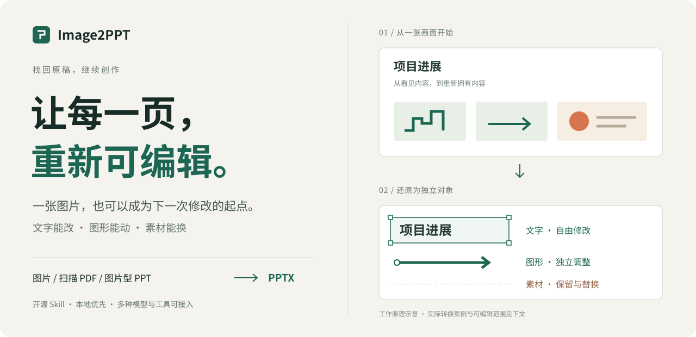
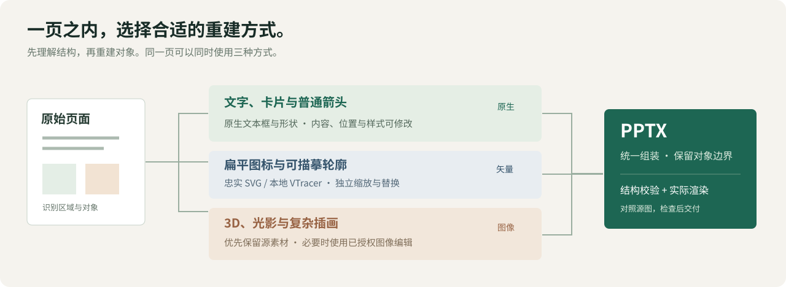

<div align="center">
  <p></p>
  <h1>Image2PPT</h1>
  <p>Return existing images, scanned PDFs, and image-only PPT/PPTX files to editable PowerPoint objects.</p>
  <p>
    <a href="https://github.com/Altria600/image2ppt/releases/tag/v1.3.0"></a>
    <a href="https://github.com/Altria600/image2ppt"></a>
    <a href="https://github.com/Altria600/image2ppt/actions/workflows/ci.yml"></a>
    <a href="LICENSE"></a>
  </p>
  <p>
    <a href="#getting-started"></a>
    <a href="README.md">中文</a>
  </p>
</div>

Image2PPT does one thing: **reconstruct an existing page, rather than authoring a new deck from an outline**. It decomposes the source into native text and structure, faithful SVG images, and bounded source assets, then rebuilds a PPTX from one `manifest.json`; each object's source and actual editability remain reviewable.

<p align="center">
  <a href="https://github.com/Altria600/image2ppt/releases/download/v1.3.0/image2ppt-portable-1.3.0.zip">Download the v1.3.0 portable package</a>
  ·
  <a href="#getting-started">Quick start</a>
  ·
  <a href="#cases-start-with-complex-pages">View cases</a>
</p>

## Cases: start with complex pages

The business and scientific examples below are historical repository examples kept to show the “source comparison + object selection” acceptance method. They are not new v1.3.0 measurements or a quality promise for arbitrary input. Selection handles in the reconstructed images only demonstrate independent object selection and do not appear in slide show mode.

<table>
  <tr>
    <td align="center" width="50%"><strong>Business page · Source</strong><br></td>
    <td align="center" width="50%"><strong>Business page · Reconstruction</strong><br></td>
  </tr>
  <tr>
    <td align="center" width="50%"><strong>Scientific figure · Source</strong><br></td>
    <td align="center" width="50%"><strong>Scientific figure · Reconstruction</strong><br></td>
  </tr>
</table>

<details>
<summary>View enlarged comparisons from the historical examples</summary>

<p align="center"></p>
<p align="center"></p>

</details>

## How far can it be edited?

“Editable” is not one binary promise. Image2PPT routes objects by type and reports the boundary of each result:

| Source object | PPTX result | What remains editable |
| --- | --- | --- |
| Text, cards, tables, ordinary arrows/connectors | Native PowerPoint objects (`native-object`) | Edit text and color, move and resize objects, and adjust connectors |
| Faithful flat icons and traceable paths | SVG images (`svg-reconstructed` / `vector-traced`) | Move, resize, or replace; edit the accompanying SVG for path/color changes |
| Photos, textures, complex illustrations, and hard-to-measure local visuals | Bounded source assets (`source-extracted`) | Replace or adjust the local asset without pretending it is a native shape |

If extraction is insufficient or an occlusion needs repair, an `image-edited` asset is created only after an image tool is explicitly selected, with the actual producer/model recorded. A full-page, full-card, full-table, or full-chart image is never used to cover objects that should remain editable.

## Getting started

### Choose an entry point

- **Download the portable package**: get [image2ppt-portable-1.3.0.zip](https://github.com/Altria600/image2ppt/releases/download/v1.3.0/image2ppt-portable-1.3.0.zip), unzip it, and give the complete directory to the host agent.
- **Codex repo skill**: copy this directory (or the unzipped portable package) to `.agents/skills/image2ppt/` in the target project; do not install it globally.
- **WorkBuddy**: run `scripts/package_skill.py` locally to create a ZIP, then use WorkBuddy's “local ZIP import”; do not rely on an unconfirmed auto-discovery directory.

```bash
python3 scripts/package_skill.py --output dist/image2ppt.zip
```

### First run

Use a project-local Python 3.10+ virtual environment rather than a global `image2ppt` command:

```bash
python3 -m venv .venv
./.venv/bin/python -m pip install -r requirements.txt
./.venv/bin/python cli/image2ppt/cli.py doctor --json
./.venv/bin/python cli/image2ppt/cli.py prepare input.pdf \
  --out-root output/image2ppt --image-backend local-only
```

`prepare` creates the input and page run directory. Follow [SKILL.md](SKILL.md) for the complete page lifecycle: reconstruction, build, rendered QA, recording, and final assembly. Images and image-only PPT/PPTX files are supported inputs too.

<details>
<summary>macOS: complete source checkout steps</summary>

```bash
python3 -m venv .venv
./.venv/bin/python -m pip install -r requirements.txt
./.venv/bin/python cli/image2ppt/cli.py doctor --json
./.venv/bin/python cli/image2ppt/cli.py prepare /path/to/input.pdf \
  --out-root output/image2ppt --image-backend local-only
```

For visual acceptance, install and use LibreOffice on the target machine. v1.3.0 has completed a real source → PPTX acceptance run on macOS + LibreOffice in this checkout. Font fallback, SVG, transparency, arrows, and formulas still need to be checked in the final environment.

</details>

<details>
<summary>Windows PowerShell: complete source checkout steps</summary>

```powershell
py -3 -m venv .venv
.venv\Scripts\python.exe -m pip install -r requirements.txt
.venv\Scripts\python.exe cli\image2ppt\cli.py doctor --json
.venv\Scripts\python.exe cli\image2ppt\cli.py prepare C:\path\to\input.pdf `
  --out-root output\image2ppt --image-backend local-only
```

Windows, PowerPoint/WPS, and WorkBuddy real-host acceptance has not been completed in this repository. Record the target machine's Python, fonts, Office/renderer version, and actual render result. Do not use `pipx`, a system-wide installation, or another Skill in place of the runtime in this directory.

</details>

## Routing map

First understand page regions, then measure and route each object; finally keep structural checks and actual render comparison in the same delivery chain.

<p align="center"></p>

1. **Read the source**: preserve page proportions, order, and necessary speaker notes.
2. **Measure and route**: send text, cards, tables, and ordinary arrows to native objects; flat icons and traceable paths to SVG; complex visuals to bounded source assets.
3. **Build and review**: generate the PPTX from `manifest.json`, check structure, provenance, fonts, and overflow, then compare the actual render with the source.

## Verification boundaries

<details>
<summary>Open the v1.3.0 verification statement</summary>

- Local full regression: **217 tests passed**. Follow-up routing, provider, package, and metadata checks: **62 targeted tests passed** (with overlap with the full suite).
- Verified: local Python 3.11, LibreOffice rendering, and a real source → PPTX page workflow; SVG PNG fallback, bounded source extraction guards, and measured native arrows also have offline coverage.
- Not claimed: Windows/WorkBuddy host acceptance, target PowerPoint/WPS rendering, or real external OCR/image API calls. Cross-platform offline CI jobs for Windows/macOS are prepared; remote results will be visible in the release workflow.
- Without a renderer, `page build` and manifest/OOXML structure checks can still run, but they are not a visual QA pass; unaccepted pages must remain explicitly pending/unsupported.

</details>

## Technical details and configuration

The default backend is `local-only`: local parsing, bounded source extraction, SVG, optional VTracer, and deterministic assembly. It does not read unselected credentials or make network calls. `host-image-tool`, `builtin-imagegen`, `external-import`, `openai-compatible-api`, and `codex-oauth` must be explicitly selected, and a failure never silently switches providers.

`config.yaml` is local-only and should be ignored by Git. `IMAGE2PPT_CONFIG_HOME` can select another config directory. Copy [config.example.yaml](config.example.yaml) and fill secrets locally:

```yaml
OPENAI_API_KEY: "your API key"
OPENAI_BASE_URL: "https://provider.example/v1"
IMAGE2PPT_IMAGE_BACKEND: "openai-compatible-api"
IMAGE2PPT_IMAGE_MODEL: "provider-model-id"
```

Remote OCR is disabled by default; add `--allow-remote-ocr` to `prepare` or `run hints` only after explicitly allowing the upload. Optional local VTracer is installed with `python -m pip install vtracer`. See [references/runtime-dependencies.md](references/runtime-dependencies.md), [references/page-decision-tree.md](references/page-decision-tree.md), [references/manifest-schema.md](references/manifest-schema.md), and [references/qa-contract.md](references/qa-contract.md) for parameters, fields, and recovery paths.

## Further reading and license

See [SKILL.md](SKILL.md) and [references/workflow.md](references/workflow.md) for the page lifecycle, sequential multi-page path, and worker ownership rules.

This local integration build is based on [Altria600/image2ppt](https://github.com/Altria600/image2ppt) and preserves the MIT license and attribution of upstream [Paul-Jeo/Image2PPT](https://github.com/Paul-Jeo/Image2PPT). Cell-lct is a vector-processing reference only; no unlicensed Cell-lct code has been copied.

If this saves you one redraw, consider giving [Image2PPT a Star on GitHub](https://github.com/Altria600/image2ppt) so more people can recover editable originals.

Released under the [MIT License](LICENSE).
