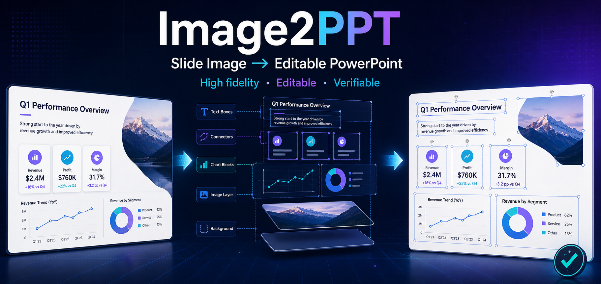
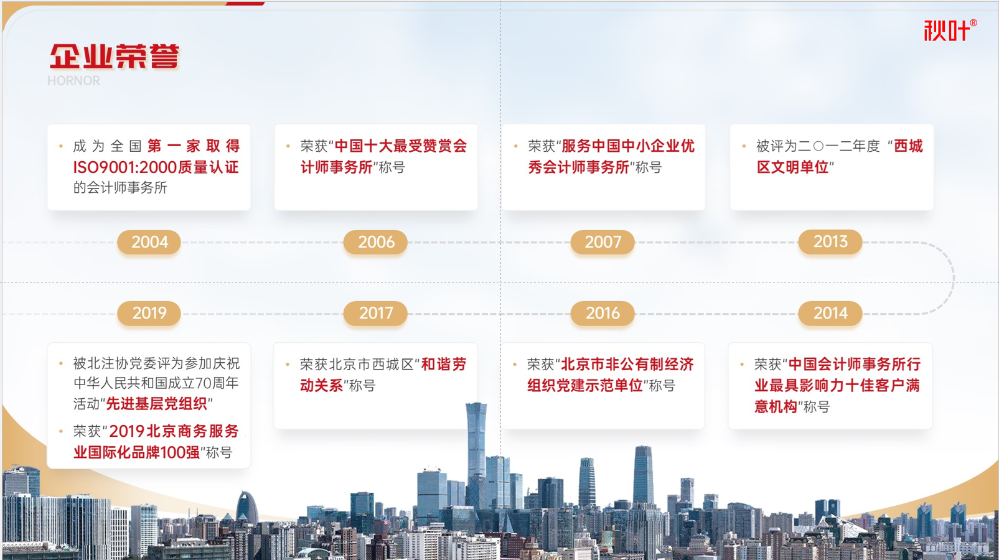
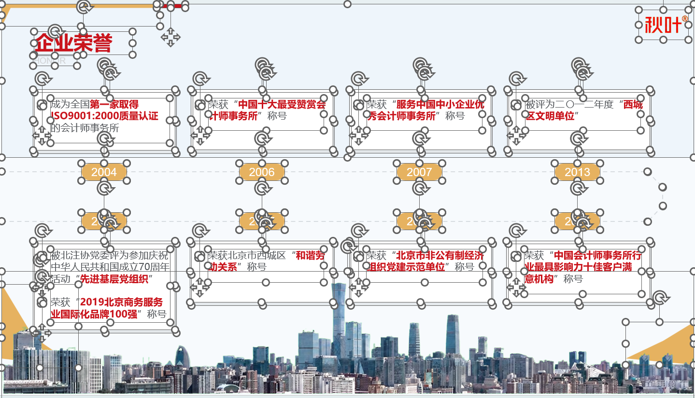
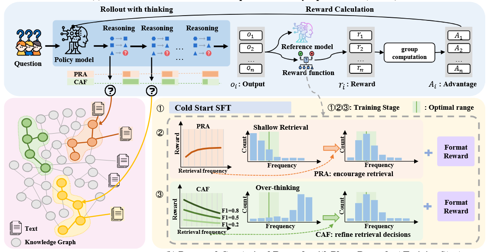
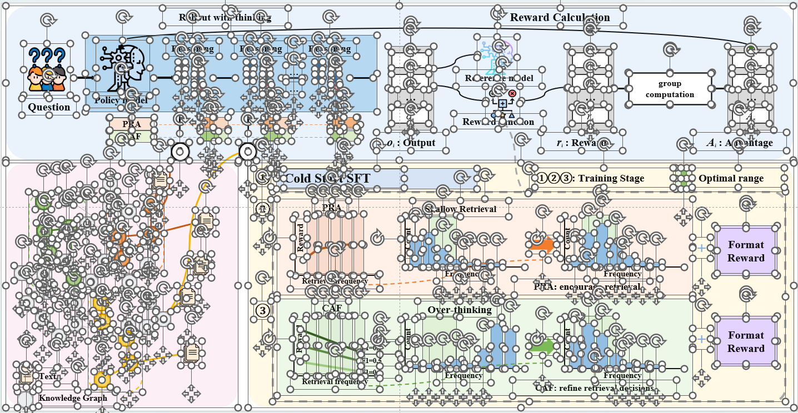
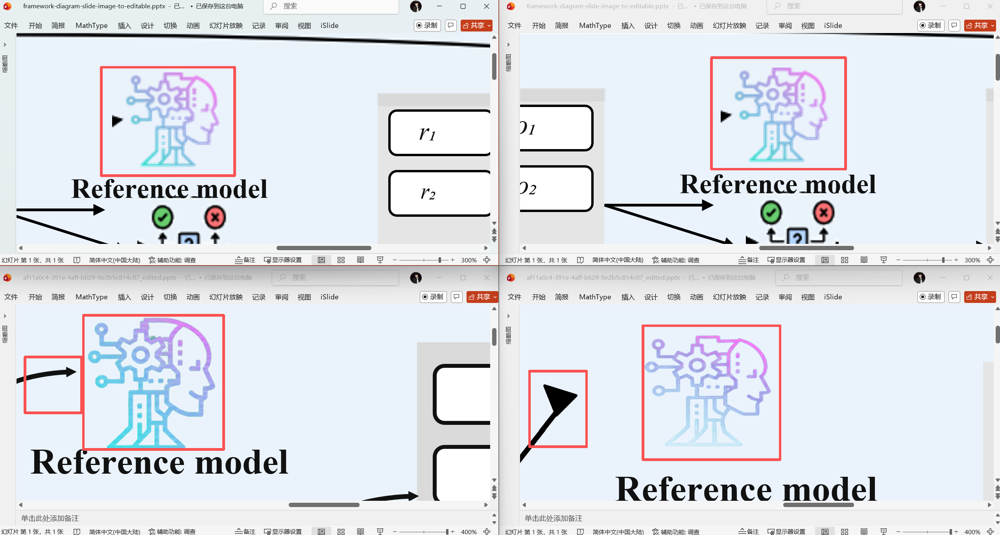
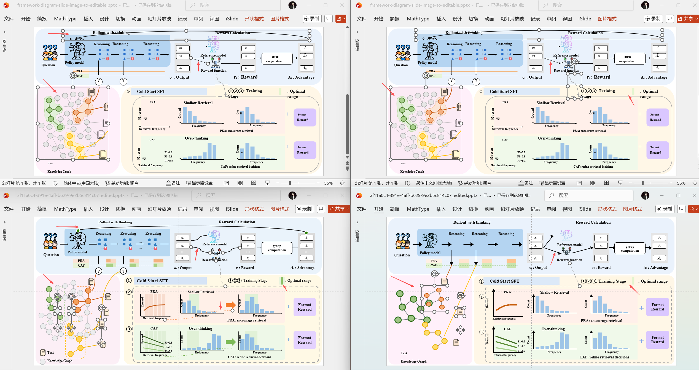

<div align="center">
  <p>
    
  </p>
  <p>
    <a href="LICENSE"></a>
    <a href="#installation-and-configuration"></a>
    <a href="README.md"></a>
  </p>
</div>

# Image2PPT

🧩 Image2PPT specializes in reconstructing **complex business slides and scientific flowcharts** as high-fidelity, object-level editable PowerPoint while preserving clarity and fine relationships in dense layouts and compound diagrams.

## Capabilities and Examples

Simple image-to-PPT pages are no longer the hard part. The real challenge is a complex page with many elements, dense relationships, small local icons, and little tolerance for errors in nodes, arrows, or spacing. Image2PPT is designed for that harder reconstruction problem:

- 🏢 **Complex business slides**: Reconstruct dense timelines, layered processes, cards, icons, and compound arrows while keeping the layout and objects editable.
- 🔬 **Complex scientific flowcharts**: Rebuild knowledge graphs and scientific frameworks node by node and relation by relation, preserving circles, connectors, arrows, and local structures.
- ✏️ **Object-level editability**: Keep text, shapes, nodes, connectors, and arrows independently selectable instead of using a full-slide screenshot as a pseudo-editable background.
- 📐 **Typography and alignment governance**: Use `text_style_id`, `alignment_group`, and `role` to record shared fonts, sizes, line heights, and source-pixel rails, then reject drift or overflow during QA.
- 🧾 **Source fidelity**: Prefer extractable PDF text and vector structure, preserve complex visuals as independent provenance-tracked local assets, and calibrate generated assets against one visual style anchor.
- ✅ **Two quality advantages**: In the like-for-like examples shown below, Image2PPT delivers the best clarity and the highest detail fidelity.

The first row below shows a complex business slide and the second a complex scientific figure; together, the two source/result pairs form a 2×2 comparison. Selection handles in converted screenshots demonstrate editable objects and do not appear in slide-show mode.

<table>
  <tr>
    <td align="center" width="50%"><strong>Business PPT · Source</strong><br></td>
    <td align="center" width="50%"><strong>Business PPT · Converted</strong><br></td>
  </tr>
  <tr>
    <td align="center" width="50%"><strong>Academic figure · Source</strong><br></td>
    <td align="center" width="50%"><strong>Academic figure · Converted</strong><br></td>
  </tr>
</table>

### 🔎 Case 1: Clarity

The figure below enlarges the same complex local region across four outputs. **Image2PPT is in the bottom-left**, while the other positions show other Image-to-PPT approaches. In this example, Image2PPT preserves icon contours, text edges, and thin lines most clearly, delivering the best overall clarity.

<p align="center"></p>

### 🧬 Case 2: Detail Fidelity

The figure below compares complete reconstructions of a complex scientific flowchart. **Image2PPT is in the bottom-left**, while the other positions show other Image-to-PPT approaches. In this example, Image2PPT most completely preserves knowledge-graph nodes, relation connectors, arrow directions, chart structures, and local layout, delivering the highest detail fidelity.

<p align="center"></p>

## Typical Requests

> Use $image2ppt to restore these slide images in order as an editable PPTX. Keep the text, timeline, and arrows editable.

> Use $image2ppt to reconstruct this scientific framework. Keep knowledge-graph nodes, relations, and ordinary arrows as independent native PowerPoint objects, and deliver only after rendered QA passes.

## What You Need to Provide

- One or more ordered PNG/JPG files, or a scanned PDF or image-only PPT/PPTX.
- Which objects must remain editable, which speaker notes must be preserved, and whether online OCR is allowed.
- For online image generation or editing, explicit permission to upload the task prompt and required page images, plus either Codex OAuth or an OpenAI Images-compatible service configuration.

## Outputs

- An object-level editable `.pptx` that preserves measurable text, shapes, nodes, connectors, and arrows.
- Page and final QA reports; complex local visuals that cannot be rebuilt reliably as native objects remain replaceable assets.

## Installation and Configuration

### 1. Get a PaddleOCR Token

Sign in to [Baidu AI Studio](https://aistudio.baidu.com/) and create a token on the [Access Token page](https://aistudio.baidu.com/account/accessToken). Image2PPT uses one `PADDLE_OCR_TOKEN`, not an AK/SK pair.

### 2. Let Your Agent Install It

Replace the token placeholder in the matching instruction, then give the whole block to your Agent.

#### Codex

> My PaddleOCR Token is `<PADDLE_OCR_TOKEN>`. Fetch the complete project from `https://github.com/Altria600/image2ppt` and install it as `.agents/skills/image2ppt` in the current project. Install the dependencies from `requirements.txt`, copy `config.example.yaml` to `config.yaml` in the same directory, and write the Token only to that file without echoing or committing it. Install any system dependencies reported by `doctor`, then run `doctor --json` and confirm that `config_scope` is `project` and the PaddleOCR Token status is `set`.

#### Claude Code

> My PaddleOCR Token is `<PADDLE_OCR_TOKEN>`. Fetch the complete project from `https://github.com/Altria600/image2ppt` and install it as `.claude/skills/image2ppt` in the current project. Install the dependencies from `requirements.txt`, copy `config.example.yaml` to `config.yaml` in the same directory, and write the Token only to that file without echoing or committing it. Install any system dependencies reported by `doctor`, then run `doctor --json` and confirm that `config_scope` is `project` and the PaddleOCR Token status is `set`.

### 3. Manual Configuration and Optional Image Backends

`config.example.yaml` is only a template; the program reads the adjacent `config.yaml`, which Git ignores. Precedence is: environment variables > `IMAGE2PPT_CONFIG_HOME` > project-level `config.yaml` > legacy `~/.image2ppt/config.yaml`.

For manual setup, copy `config.example.yaml` to an adjacent `config.yaml` and fill the PaddleOCR Token:

```yaml
PADDLE_OCR_TOKEN: "your-token"
```

Image generation and editing prefer the Agent's built-in image tool; the CLI can also use Codex OAuth. To use a third-party image model, add an OpenAI Images-compatible service configuration to the same `config.yaml`:

```yaml
OPENAI_API_KEY: "your-api-key"
OPENAI_BASE_URL: "https://provider.example/v1"
IMAGE2PPT_IMAGE_BACKEND: "openai-compatible-api"
IMAGE2PPT_IMAGE_MODEL: "provider-model-id"
```

`auto` selects `codex-oauth` only when the model ID is GPT Image-compatible and local Codex auth exists; other model IDs use `openai-compatible-api`. Third-party endpoints never receive Codex OAuth credentials, but they do receive the task prompt and required page images.

If the Token is unavailable or network OCR fails, Image2PPT falls back to `builtin-ink`, which measures text regions but does not recognize their contents.

## Boundaries

- Reconstructs existing visual pages; it does not author a new presentation from notes, papers, or outlines.
- Complex illustrations, photos, and local effects that cannot be measured reliably may remain independent image assets; not every element is guaranteed to become a native shape.
- Low-resolution sources and missing fonts limit fidelity. Acceptance depends on source comparison and actual rendered QA; not every page can be guaranteed pixel-identical.
- Online OCR uploads current task pages to Baidu services, so sensitive material should use offline mode.
- Online image generation or editing sends the current task prompt and required page images to the selected image service; use offline mode or an approved service for sensitive material.

## License

Released under the [MIT License](LICENSE).

This customized distribution is based on [Paul-Jeo/Image2PPT](https://github.com/Paul-Jeo/Image2PPT) and preserves the upstream copyright and license.
